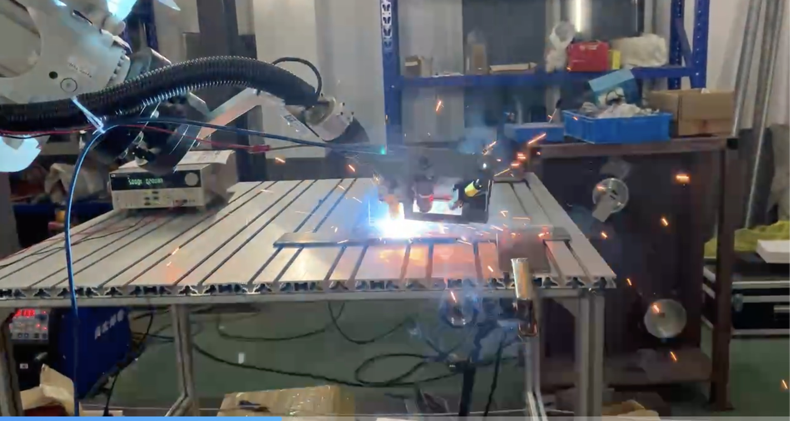
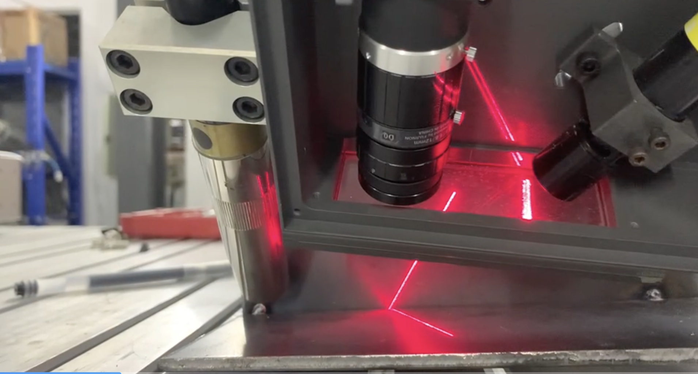
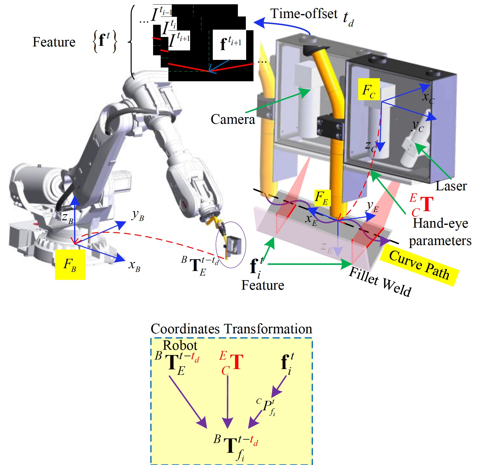
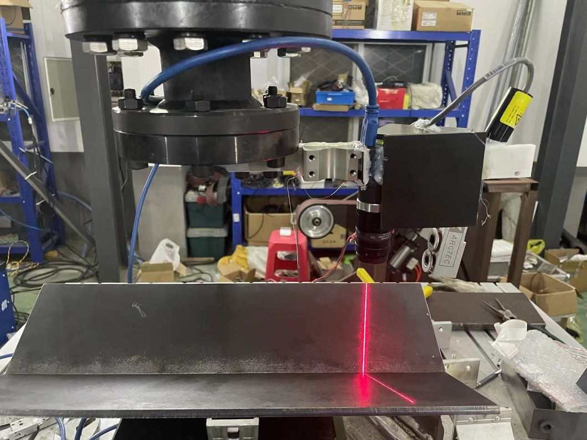
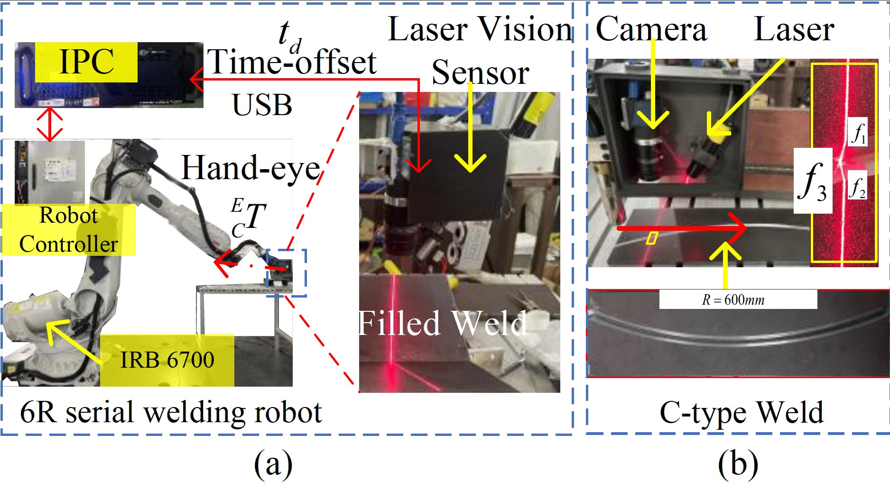
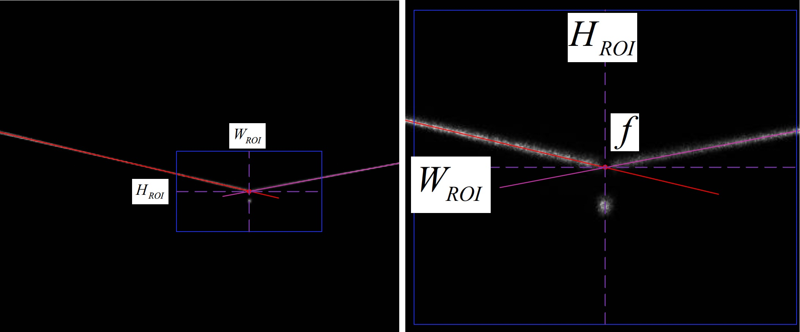
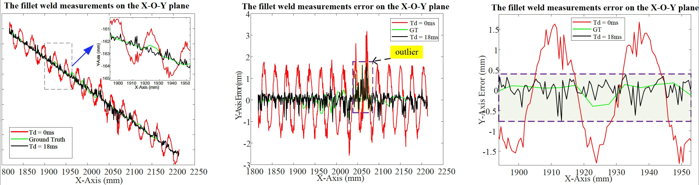
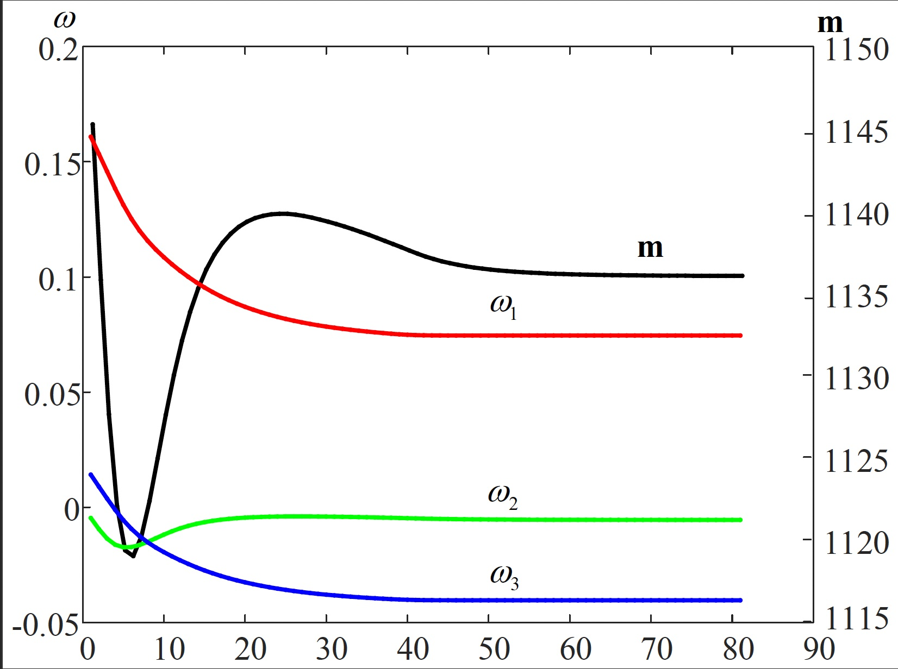
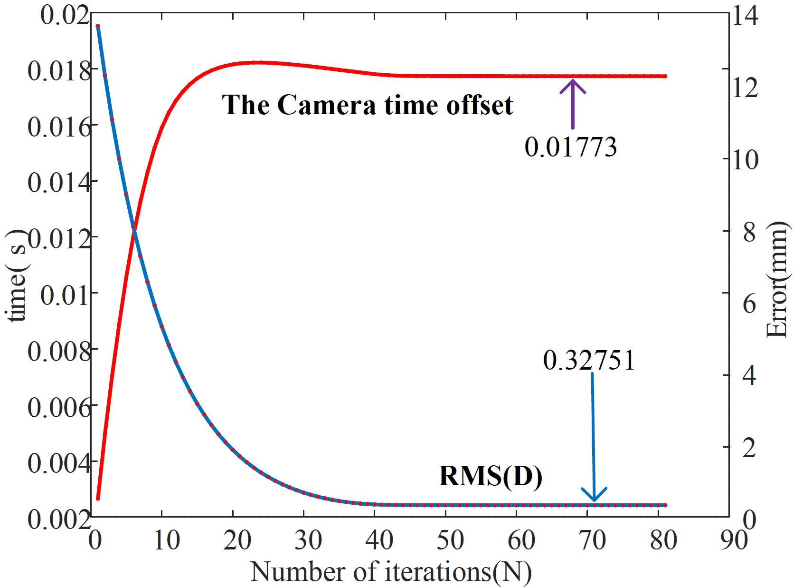

# Spatiotemporal Calibration for Laser Vision Sensor in Hand-eye System Based on Straight-line Constraint

The paper was submitted to *IEEE TIE*. We developed a *laser vision sensor*, which can be used for 3D construction, welding, etc. This research proposed a teaching-free quick spatiotemporal calibration method, only relying on a common straight object. 

This repository contains our experimental data, including measured robot end-effector's pose and images. Videos of the calibration data collection process are also available at: [https://drive.google.com/drive/folders/1Pr17LXiu3qDicMFDcD92kjfhX2Ftdzxk?usp=share_link](https://drive.google.com/drive/folders/1Pr17LXiu3qDicMFDcD92kjfhX2Ftdzxk?usp=share_link)

If you have any question, feel free to contact me: peiwen1.yang@connect.polyu.hk

## Theory and Experimental Setup

### Introduction

The laser vision sensor (LVS), acting as the “eye” of an industrial robot, allows it to perceive geometric information in its environment. However, the camera communication delay will lead to a time mismatch between captured images and the robot’s motions, and hand-eye extrinsic parameters may vary during the manufacturing process. To address these issues, we propose a measurement model of LVS considering the effect of camera’s time-offset and a teaching-free spatiotemporal calibration method utilizing line constraints. This method is achieved by making a robot equipped with an LVS repeatedly scan along straight-line fillet welds with S-shaped trajectories. No matter how the robot’s orientation changes, all measured welding positions are constrained within a straight-line, which is represented using pucker coordinates. Moreover, a nonlinear optimization model based on a straight-line constraint is established. Subsequently, the Levenberg-Marquardt (LM) algorithm is employed to solve the parameters, including time-offset, hand-eye extrinsic parameters, and straight-line parameters. The feasibility and accuracy of this approach are validated through simulation and a curve weld scanning experiment. We open-source the code at https://github.com/RoboticsPolyu/LVS_ST_CALIB.






### Calibration Method





### Experiment System



### Results









## Dataset

https://drive.google.com/drive/folders/1Pr17LXiu3qDicMFDcD92kjfhX2Ftdzxk?usp=share_link

## Program

The spatiotemporal calibration program is as follows:

```
spatiotemporal_calibration_lvs 
```

This repo also provides functions, such as the laser camera calibration, fillet weld feature detector, and spatiotemproal calibration simulation.

Enjoy !
